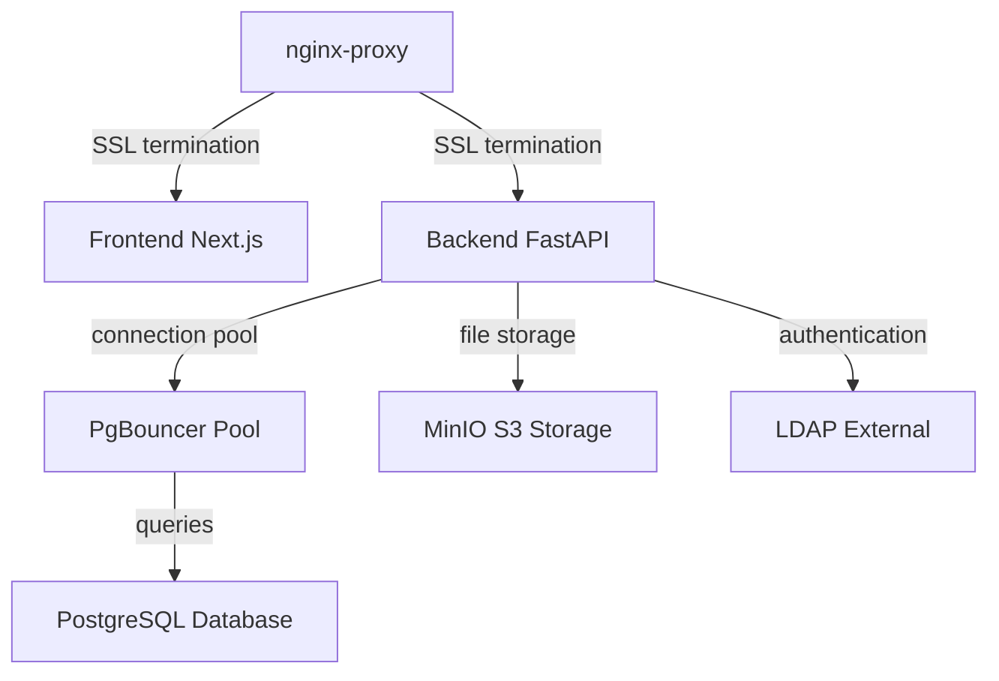

# Architecture

## Overview

The application uses a microservices architecture with separate frontend and backend services, connection pooling layer, and support for both local and external data services.



## Requirements

```
Hardware
├── CPU: 2+ cores
├── RAM: 4GB+
└── Disk: 100GB+ storage

Software
├── Docker Engine 20.10+
├── Docker Compose 2.0+
├── Ubuntu 22.04 (or compatible)
└── OpenSSL (for certificate generation)

Network
└── Web Domain: A registered domain name is required (e.g., chat.example.com)
```

## Services

```
nginx-proxy
├── Reverse proxy and SSL termination
├── Routes traffic to frontend
└── Manages Let's Encrypt certificates via acme-companion

acme-companion
├── Automatic SSL certificate generation and renewal
└── Only active when no domain certificate files exist in ./certs/nginx/

frontend
├── Next.js application serving user interface
├── Communicates with backend API
└── Port 3000 (internal)

backend
├── FastAPI application handling business logic
├── Manages authentication, chat, file uploads
└── Connects to database, S3, and optionally LDAP

pgbouncer
├── Connection pooling for PostgreSQL
├── Reduces database connection overhead
└── Supports SSL for client and server connections

postgres
├── PostgreSQL database
├── Stores application data
└── Optional SSL encryption

minio
├── S3-compatible object storage
├── Stores uploaded files and media
└── Can be replaced with external S3 service

migrate
├── Database migration service
├── Runs Alembic migrations on startup
└── Exits after completion
```

## Directory Structure

```
.
├── wui                   WUI binary executable
├── .wui                  WUI configuration file
├── backend/              Backend Docker build context
├── frontend/             Frontend Docker build context
├── pgbouncer/            PgBouncer configuration and Dockerfile
├── postgres/             PostgreSQL configuration and Dockerfile
├── nginx/                Nginx virtual host configuration
├── certs/                SSL certificates directory
│   ├── backend/          Client certificates for backend
│   ├── pgbouncer/        Server certificates for PgBouncer
│   ├── postgres/         Server certificates for PostgreSQL
│   └── nginx/            Nginx SSL certificates
├── tools/                Utility scripts
│   ├── certs             Certificate generation tool
│   └── ldap              LDAP debugging tool
├── docker-compose.yml    Service orchestration
├── .env.example          Example configuration file
└── .env                  Configuration file

```

## Authentication Modes

**Database Mode** (`LDAP_USE_LDAP=False`)
- Users register with email and password
- User accounts stored in PostgreSQL
- Superuser created from `APP_SUPERUSER_EMAIL` and `APP_SUPERUSER_PASSWORD`
- Recommended: Change superuser password after first login
- Standard password reset and account management

**LDAP Mode** (`LDAP_USE_LDAP=True`)
- Registration disabled in frontend
- Recommended for Microsoft Active Directory
- Authentication flow:
  1. Service account (from `LDAP_USER` and `LDAP_PWD`) connects to LDAP server
  2. Service account queries directory for user data
  3. User credentials validated against directory
  4. User matched by `sAMAccountName` in Active Directory
- Superuser identified by matching `APP_SUPERUSER_EMAIL` to directory email
- `APP_SUPERUSER_PASSWORD` ignored
- Superuser can grant admin privileges to other users via `/admin` endpoint

