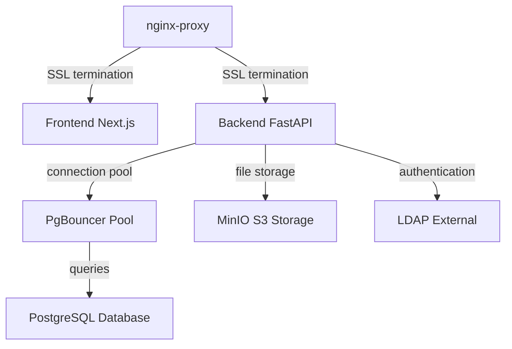

# Anonym Chat Setup

## Quick Navigation

- [Quick Start](#quick-start) - Installation and deployment
- [Overview](docs/overview.md) - Project description and features
- [Web UI Configuration](docs/web-ui-configuration.md) - Browser-based configuration tool
- [Architecture](docs/architecture.md) - System design and requirements
- [Configuration](docs/configuration.md) - Environment variables reference
- [Tools](docs/tools.md) - Certificate and LDAP utilities

## Quick Start

### Installation Requirements

See [Architecture - Requirements](docs/architecture.md#requirements) for detailed system requirements.

### Installation

**1. Add SSH key to GitHub**

This is a private repository. Ensure your SSH key is added to your GitHub account before cloning.

**2. Clone repository**

```terminal
git clone git@github.com:Giorgi-Sekhniashvili/anonym-chat-setup.git
```

**3. Navigate to project**

```terminal
cd anonym-chat-setup
```

**4. Create environment file**

```terminal
cp .env.example .env
```

This creates your configuration file with default values. You can now configure the application using either method:

**Option A: Web UI Configuration (Recommended)**

The WUI will read the `.env` file and populate all fields with current values. See [Web UI Configuration](docs/web-ui-configuration.md) for detailed instructions.

**Option B: Manual Configuration**

Edit `.env` directly and set required configurations. See [Configuration](docs/configuration.md) for detailed options.

**5. Configure SSL certificates (Optional)**

You can skip this step if you are not using ssl.

**For Nginx:**

- **Production certificates**: Place your certificates in `./certs/nginx/` named as `${APP_DOMAIN}.crt` and `${APP_DOMAIN}.key`
- **Let's Encrypt (free)**: Ensure no certificate files for your domain exist in `./certs/nginx/` - certificates will be generated automatically
- **Self-signed certificates**: Generate using `tools/certs` (see [Tools](docs/tools.md)) and set `NODE_TLS_REJECT_UNAUTHORIZED=0` in `.env` (see [Configuration - Local/Unsafe](docs/configuration.md#localunsafe))

**For Database SSL:**

1. Place client certificates in `./certs/backend/`
2. Place server certificates in `./certs/pgbouncer/`
3. Place server certificates in `./certs/postgres/`

**For LDAP SSL:**

Place CA certificate in `./certs/backend/${LDAP_CA_FILE}` where `${LDAP_CA_FILE}` matches your `.env` configuration.

**Generate all self-signed certificates:**

```terminal
tools/certs all
```

See [Tools - Certificate Generator](docs/tools.md#certificate-generator) for more options.

**Note**: Alternatively, see [Web UI Configuration - Certificates](docs/web-ui-configuration.md#certificates-tab) for web-based certificate management.

**6. Login to Docker registry (required)**

```terminal
docker login registry.anonym.giorgis.ink
```

Enter the username and password provided to you. Registry access credentials are provided before deployment.

**7. Start services**

```terminal
docker compose up -d
```

**8. Post-deployment**

For database authentication mode, change the superuser password after first login for security.

### Update or Reconfigure

**1. Pull latest changes**

```terminal
git pull
```

Or apply your local changes if working on a custom branch.

**2. Review patch notes**

Check patch notes provided with updates for breaking changes or migration steps.

**3. Stop affected services**

Stop all services:

```terminal
docker compose down
```

Stop specific services:

```terminal
docker compose down backend frontend
```

**4. Apply environment changes**

Edit `.env` if configuration updates are required.

**5. Run migrations**

If database schema changes are included:

```terminal
docker compose up -d --build migrate
```

**6. Restart services**

```terminal
docker compose up -d
```

### Common Issues

**Cached volumes after configuration changes**

Docker volumes persist data between restarts. After configuration changes, you may need to remove volumes:

```terminal
docker compose down -v <service_name>
```

**Warning**: Removing ```postgres``` service with volumes will result removing the `postgres-data` volume and will delete all database data.

**Self-signed Nginx certificates**

When using self-signed certificates for Nginx, set `NODE_TLS_REJECT_UNAUTHORIZED=0` in `.env`. See [Configuration - Local/Unsafe](docs/configuration.md#localunsafe).

**Let's Encrypt not activating**

Ensure no certificate files for your domain exist in `./certs/nginx/`. The presence of `${APP_DOMAIN}.crt` or `${APP_DOMAIN}.key` will prevent the ACME companion from generating certificates.

**LDAP connection issues**

Verify LDAP SSL configuration:
- Ensure `LDAP_CA_FILE` is present in `./certs/backend/` when using SSL
- Use the LDAP debugging tool: `tools/ldap username password`

See [Tools - LDAP Debugger](docs/tools.md#ldap-debugger) for detailed troubleshooting.

---

## Best Practices

### Version Control

When customizing this template:

1. Create a private offline Git branch for your modifications
2. Keep the original branch as backup
3. Merge updates from upstream carefully
4. Document your changes in commit messages

### Security

- Use strong passwords for all services
- Enable SSL/TLS for production deployments
- Use production certificates from trusted CA (Let's Encrypt, commercial CA)
- Restrict `APP_ALLOWED_ORIGINS` to known domains
- Keep Docker images updated
- Regularly rotate `APP_SECRET_KEY` and service passwords

### Scaling

- Increase `APP_WORKERS` based on CPU cores
- Adjust PgBouncer pool sizes for concurrent users
- Monitor database connections and adjust `DB_MAX_CONNECTIONS`
- Consider external PostgreSQL for high-traffic deployments
- Use external S3 service for better file storage scalability

### Monitoring

- Check Docker logs: `docker compose logs -f [service]`
- Monitor resource usage: `docker stats`
- Review application logs in backend container
- Set up external monitoring for production

# Overview

This project is a deployment setup template for Anonym Chat, not the application itself. It is meant to be modified and provides a ready-to-use Docker Compose configuration with sensible defaults for deploying the complete chat solution on-premise.
It can be deployed in multiple configurations. It supports both local containerized and external services, with comprehensive SSL/TLS support and multiple authentication modes.

## Key Features

- **Flexible Deployment**: Use local Docker services or connect to external infrastructure
- **Dual Authentication**: Database-based or LDAP/Active Directory authentication
- **SSL/TLS Support**: Full encryption for all services with self-signed or production certificates
- **Configuration-Driven**: All settings managed through `.env` file
- **Scalable Architecture**: Connection pooling with PgBouncer, configurable worker processes

## Deployment Modes

**Local Services**
- PostgreSQL database container
- MinIO S3-compatible storage
- All services within Docker network

**External Services**
- Connect to external PostgreSQL instance
- Use external S3-compatible storage
- Hybrid configurations supported

## Authentication Modes

**Database Authentication**
- Traditional email/password registration
- User management through application
- Superuser account created on first deployment
- Recommended: Change superuser password after first login

**LDAP/Active Directory**
- Enterprise SSO integration
- Recommended for Microsoft Active Directory
- Disables registration, uses directory credentials
- Service account connects to LDAP server to query user data
- User authentication validated against directory
- Superuser matched by email in directory
- Superuser can grant admin privileges to other users via `/admin` endpoint

# Web UI Configuration

## Overview

The Web UI (WUI) provides a browser-based interface for configuring environment variables and managing SSL certificates. It serves as an alternative to manually editing `.env` files and placing certificate files in directories. The WUI includes three main sections: Configuration, Certificates, and References.

## Prerequisites

The `.wui` configuration file is already present in the repository and ready to use. You can modify this file if you need to change the port or host binding.

Default `.wui` settings:
- PORT: `:3030`
- HOST: `localhost`
- GOENV: `production`
- OUTPUT: `.env`

## Starting the Web UI

Run the WUI binary from the project root:

```terminal
./wui
```

The binary will start a web server on the configured port. If HOST is set to `localhost`, the binary will automatically detect and display your public IP address for remote browser access.

## Accessing the Interface

Once the WUI is running:

- **Default access**: `http://localhost:3030`
- **Remote access**: If HOST=localhost, use the public IP displayed by the binary
- **Network access**: If HOST=0.0.0.0, accessible from any network interface at `http://[server-ip]:3030`

## Web UI Features

The WUI interface is organized into three main tabs accessible from the top navigation.

### Configuration Tab

The Configuration tab provides a comprehensive form-based interface for all environment variables:

**Service Categories**:
- Application - General application settings
- LDAP / Active Directory - Authentication configuration
- PostgreSQL - Database connection settings
- PgBouncer - Connection pooling configuration
- S3 Minio - Object storage settings
- AI Services - OpenAI and Azure Language Service configuration
- Next.js Frontend - Frontend application settings

**Features**:
- All fields are pre-filled with default values
- Required fields are marked with a red asterisk (*)
- Real-time form validation
- Smart error handling: If required fields are missing, an error toast notification appears with a clickable link
- Clicking the error notification automatically scrolls to the missing field with an animated border highlight
- Click "Save" button to generate or update the `.env` file in the project root
- Each save operation overwrites the existing `.env` file with current form values

**Workflow**:
1. Navigate through service tabs to configure each component
2. Fill in required fields (marked with *)
3. Click "Save" to generate `.env` file
4. If validation fails, click the error notification to jump to the problematic field
5. After successful save, proceed with Docker deployment

### Certificates Tab

The Certificates tab provides visual SSL/TLS configuration management:

**Features**:
- Choose SSL/TLS options for different services
- Upload custom certificates through the web interface
- Alternative to manually placing certificate files in `./certs/` directories
- Visual configuration for Nginx, Database, PgBouncer, and LDAP certificates

**Use Cases**:
- Upload production certificates without command-line file operations
- Configure Let's Encrypt settings
- Manage self-signed certificate options
- Centralized certificate management interface

### References Tab

The References tab provides a searchable encyclopedia of all configuration variables:

**Features**:
- Complete list of all environment variables with descriptions
- Search functionality by name, description, category, or current value
- Color-coded categories for easy identification
- Displays current values from your `.env` file
- Click any variable name to navigate directly to its field in the Configuration tab with highlight animation

**Use Cases**:
- Quick reference when you need to find a specific variable
- Search for variables by functionality (e.g., search "SSL" to find all SSL-related settings)
- Verify current configuration values
- Navigate quickly to specific fields for editing

## WUI Configuration File

The `.wui` file in the project root controls WUI behavior:

```
PORT=:3030          # Port for WUI web interface (e.g., :3030, :8080)
HOST=localhost      # Host binding (localhost or 0.0.0.0 for all interfaces)
GOENV=production    # WUI environment mode (production/dev)
OUTPUT=.env         # Output file path for generated configuration
```

**Configuration Options**:

**PORT**
- Web server port for the WUI interface
- Format: `:PORT_NUMBER` (e.g., `:3030`, `:8080`)
- Change if port 3030 is already in use
- Default: `:3030`

**HOST**
- Host binding for the web server
- `localhost`: Only accessible from local machine (binary shows public IP for remote access)
- `0.0.0.0`: Accessible from any network interface
- Default: `localhost`

**GOENV**
- Environment mode for the WUI application
- Values: `production`, `dev`
- Default: `production`

**OUTPUT**
- Path where the generated `.env` file will be written
- Relative to WUI binary location
- Default: `.env`

**Note**: When HOST=localhost, the `./wui` binary automatically detects and displays your public IP address so you can access the interface from a browser on another machine.

# Architecture

## Overview

The application uses a microservices architecture with separate frontend and backend services, connection pooling layer, and support for both local and external data services.



## Requirements

```
Hardware
├── CPU: 2+ cores
├── RAM: 4GB+
└── Disk: 100GB+ storage

Software
├── Docker Engine 20.10+
├── Docker Compose 2.0+
├── Ubuntu 22.04 (or compatible)
└── OpenSSL (for certificate generation)

Network
└── Web Domain: A registered domain name is required (e.g., chat.example.com)
```

## Services

```
nginx-proxy
├── Reverse proxy and SSL termination
├── Routes traffic to frontend
└── Manages Let's Encrypt certificates via acme-companion

acme-companion
├── Automatic SSL certificate generation and renewal
└── Only active when no domain certificate files exist in ./certs/nginx/

frontend
├── Next.js application serving user interface
├── Communicates with backend API
└── Port 3000 (internal)

backend
├── FastAPI application handling business logic
├── Manages authentication, chat, file uploads
└── Connects to database, S3, and optionally LDAP

pgbouncer
├── Connection pooling for PostgreSQL
├── Reduces database connection overhead
└── Supports SSL for client and server connections

postgres
├── PostgreSQL database
├── Stores application data
└── Optional SSL encryption

minio
├── S3-compatible object storage
├── Stores uploaded files and media
└── Can be replaced with external S3 service

migrate
├── Database migration service
├── Runs Alembic migrations on startup
└── Exits after completion
```

## Directory Structure

```
.
├── wui                   WUI binary executable
├── .wui                  WUI configuration file
├── backend/              Backend Docker build context
├── frontend/             Frontend Docker build context
├── pgbouncer/            PgBouncer configuration and Dockerfile
├── postgres/             PostgreSQL configuration and Dockerfile
├── nginx/                Nginx virtual host configuration
├── certs/                SSL certificates directory
│   ├── backend/          Client certificates for backend
│   ├── pgbouncer/        Server certificates for PgBouncer
│   ├── postgres/         Server certificates for PostgreSQL
│   └── nginx/            Nginx SSL certificates
├── tools/                Utility scripts
│   ├── certs             Certificate generation tool
│   └── ldap              LDAP debugging tool
├── docker-compose.yml    Service orchestration
├── .env.example          Example configuration file
└── .env                  Configuration file

```

## Authentication Modes

**Database Mode** (`LDAP_USE_LDAP=False`)
- Users register with email and password
- User accounts stored in PostgreSQL
- Superuser created from `APP_SUPERUSER_EMAIL` and `APP_SUPERUSER_PASSWORD`
- Recommended: Change superuser password after first login
- Standard password reset and account management

**LDAP Mode** (`LDAP_USE_LDAP=True`)
- Registration disabled in frontend
- Recommended for Microsoft Active Directory
- Authentication flow:
  1. Service account (from `LDAP_USER` and `LDAP_PWD`) connects to LDAP server
  2. Service account queries directory for user data
  3. User credentials validated against directory
  4. User matched by `sAMAccountName` in Active Directory
- Superuser identified by matching `APP_SUPERUSER_EMAIL` to directory email
- `APP_SUPERUSER_PASSWORD` ignored
- Superuser can grant admin privileges to other users via `/admin` endpoint

# Configuration

Configuration is managed through the `.env` file. Copy `.env.example` to `.env` and adjust values for your deployment.

## General

**APP_ENV**
- Environment mode
- Values: `dev`, `prod`
- Default: `dev`

**APP_WORKERS**
- Number of backend worker processes
- Adjust based on CPU cores and load
- Recommended: 2-4 for small deployments, 4-8 for production
- Default: `3`

**APP_DOMAIN**
- Primary domain for the application
- Used for Nginx routing and Let's Encrypt
- Example: `chat.example.com`

**APP_CERTS_PATH**
- Base path for SSL certificates
- Relative to project root
- Default: `./certs`

**APP_LOG_LEVEL**
- Application logging verbosity
- Values: `DEBUG`, `INFO`, `WARNING`, `ERROR`, `CRITICAL`
- Default: `INFO`

**APP_SECRET_KEY**
- Secret key for session encryption and JWT signing
- Generate a strong random string
- Example: `openssl rand -hex 32`

**APP_ALLOWED_ORIGINS**
- CORS allowed origins as JSON array
- Include all domains that will access the API
- Example: `["https://chat.example.com","http://localhost:3000"]`

**APP_SUPERUSER_EMAIL**
- Email for initial superuser account
- In database mode: creates account with this email
- In LDAP mode: matches directory user by email to grant admin privileges
- Example: `admin@chat.example.com`

**APP_SUPERUSER_PASSWORD**
- Password for initial superuser account
- Only used in database mode
- Ignored in LDAP mode
- Example: `SecurePassword123`

## Local/Unsafe

**NODE_TLS_REJECT_UNAUTHORIZED**
- Disable TLS certificate validation in Node.js
- Required when using self-signed certificates for Nginx
- Values: `0` (disable), `1` (enable)
- Only use for testing/development
- Comment out or remove for production with valid certificates

## PgBouncer

Connection pooling configuration. Adjust based on expected concurrent users and database capacity.

**PGBOUNCER_LISTEN_PORT**
- Port PgBouncer listens on
- Default: `6432`

**PGBOUNCER_POOL_MODE**
- Connection pooling strategy
- Values: `session`, `transaction`, `statement`
- Recommended: `transaction` for most applications
- Default: `transaction`

**PGBOUNCER_MAX_CLIENT_CONN**
- Maximum client connections to PgBouncer
- Should be higher than expected concurrent users
- Default: `5000`

**PGBOUNCER_MIN_POOL_SIZE**
- Minimum database connections to maintain
- Default: `30`

**PGBOUNCER_DEFAULT_POOL_SIZE**
- Default database connections per user/database pair
- Default: `60`

**PGBOUNCER_RESERVE_POOL_SIZE**
- Additional connections for high load
- Default: `10`

**PGBOUNCER_RESERVE_POOL_TIMEOUT**
- Timeout for reserve pool connections (seconds)
- Default: `10`

**PGBOUNCER_CLIENT_TLS_SSLMODE**
- SSL mode for client connections to PgBouncer
- Values: `disable`, `allow`, `prefer`, `require`, `verify-ca`, `verify-full`
- Use `verify-full` with SSL certificates
- Default: `verify-full`

**PGBOUNCER_SERVER_TLS_SSLMODE**
- SSL mode for PgBouncer connections to PostgreSQL
- Values: same as `PGBOUNCER_CLIENT_TLS_SSLMODE`
- Default: `verify-full`

## Database

**DB_NAME**
- PostgreSQL database name
- Default: `anonym`

**DB_HOST**
- Database host
- For local: `pgbouncer` (uses connection pooling)
- For external: external hostname or IP
- Default: `pgbouncer`

**DB_USER**
- Database username
- Must match client certificate CN when using SSL
- Default: `postgres`

**DB_PASSWORD**
- Database password
- Default: `postgres`

**DB_PORT**
- Database port
- For PgBouncer: `6432`
- For direct PostgreSQL: `5432`
- Default: `6432`

**DB_MAX_CONNECTIONS**
- Maximum connections PostgreSQL will accept
- Must be higher than PgBouncer pool sizes
- Default: `120`

**DB_POOL_SIZE**
- SQLAlchemy connection pool size per backend worker
- Default: `15`

**DB_MAX_OVERFLOW**
- Additional connections beyond pool size
- Default: `5`

**DB_POOL_TIMEOUT**
- Connection acquisition timeout (seconds)
- Default: `35`

**DB_POOL_RECYCLE**
- Recycle connections after this many seconds
- Prevents stale connections
- Default: `1800` (30 minutes)

**DB_POOL_PRE_PING**
- Test connections before using
- Recommended: `True`
- Default: `True`

## Database Encryption

**DB_USE_SSL**
- Enable SSL for database connections
- Values: `True`, `False`
- Default: `True`

**DB_SSL_CA_FILE**
- CA certificate filename in `./certs/backend/`
- Default: `ca.pem`

**DB_SSL_CERT_FILE**
- Client certificate filename in `./certs/backend/`
- Default: `client-certificate.pem`

**DB_SSL_KEY_FILE**
- Client private key filename in `./certs/backend/`
- Default: `client-private-key.pem`

## LDAP

Configuration for LDAP/Active Directory authentication. Recommended for Microsoft Active Directory environments.

**LDAP_USE_LDAP**
- Enable LDAP authentication mode
- Values: `True`, `False`
- When `True`: disables registration, uses directory authentication
- Recommended for Microsoft Active Directory
- Default: `False`

**LDAP_HOST**
- LDAP server hostname or IP
- Example: `ad.example.com`

**LDAP_PORT**
- LDAP server port
- Standard LDAP: `389`
- LDAPS: `636`
- Default: `389`

**LDAP_USE_SSL**
- Enable SSL/TLS for LDAP
- Values: `True`, `False`, `starttls`, `ldaps`
- Recommended: `True` or `ldaps` for production
- Default: `False`

**LDAP_CA_FILE**
- CA certificate filename in `./certs/backend/`
- Required when `LDAP_USE_SSL=True`
- Example: `ldap_ca.pem`

**LDAP_USER**
- Service account username for LDAP queries
- Should have read access to user directory
- Example: `ldap_service_user`

**LDAP_PWD**
- Service account password
- Example: `ServicePassword123`

**LDAP_DOMAIN**
- Active Directory domain
- Example: `anonym.domain.com`

**LDAP_OU**
- Organizational Unit path for service account
- Example: `OU=SERVICE_USERS,OU=ACCOUNTS`

**LDAP_DCS**
- Domain Components for base DN
- Example: `DC=anonym,DC=domain,DC=com`

## MinIO

S3-compatible object storage configuration. Can be replaced with external S3 service (AWS, DigitalOcean Spaces, etc.).

**MINIO_ACCESS_KEY_ID**
- S3 access key
- For local MinIO: set any value
- For external S3: use provided access key
- Example: `s3_username`

**MINIO_SECRET_ACCESS_KEY**
- S3 secret key
- For local MinIO: set any value
- For external S3: use provided secret key
- Example: `s3_password`

**MINIO_BUCKET_NAME**
- S3 bucket name for file storage
- Bucket created automatically for local MinIO
- For external S3: create bucket manually
- Default: `chat-bucket`

**MINIO_ENDPOINT_URL**
- S3 endpoint URL
- For local MinIO: `http://minio:9000`
- For AWS S3: `https://s3.amazonaws.com`
- For other providers: use provider-specific endpoint

## OpenAI

**OPENAI_API_KEY**
- OpenAI API key for AI features
- Obtain from OpenAI platform
- Example: `sk-...`

**OPENAI_DEFAULT_MODEL_ID**
- Default OpenAI model to use
- Example: `gpt-4`, `gpt-3.5-turbo`
- Default: `gpt-4`

## Next.js

**NEXT_PUBLIC_API_URL**
- Backend API URL used by frontend (browser) through Nginx
- Should match `APP_DOMAIN`
- Example: `https://chat.example.com/api`
- Recommended: Leave as default

**NEXT_PRIVATE_API_URL**
- Backend API URL used by Next.js server-side
- Internal Docker network communication
- Example: `http://backend:8000/api`
- Recommended: Leave as default

**NEXT_PUBLIC_USE_LDAP**
- Frontend LDAP mode flag
- Values: `true`, `false`
- Should match `LDAP_USE_LDAP`
- Controls registration UI visibility

# Tools

Utility scripts for certificate generation and LDAP debugging. Located in `tools/` directory.

## Certificate Generator

Script: `tools/certs`

Generates self-signed SSL certificates for all services. Certificates are valid for 10 years (3650 days).

**Prerequisites**

OpenSSL must be installed:

```terminal
command -v openssl
```

**Commands**

Generate all certificates:

```terminal
tools/certs all
```

Generate CA only:

```terminal
tools/certs ca
```

Generate specific service certificates:

For Nginx:
```terminal
tools/certs nginx
```

For PostgreSQL:
```terminal
tools/certs postgres
```

For PgBouncer:
```terminal
tools/certs pgbouncer
```

For Backend:
```terminal
tools/certs backend
```

Show required environment variables:

```terminal
tools/certs env
```

Show configured domains:

```terminal
tools/certs domains
```

Verify client certificate:

```terminal
tools/certs verify
```

Clean all generated certificates:

```terminal
tools/certs clean
```

**Certificate Details**

- **CA Certificate**: Self-signed root CA for signing service certificates
- **Nginx Certificate**: Self-signed certificate for domain (not from CA)
- **PostgreSQL Certificate**: Server certificate signed by CA
- **PgBouncer Certificate**: Server certificate signed by CA
- **Backend Certificate**: Client certificate signed by CA, CN must match `DB_USER`

**After Generation**

1. Verify client certificate CN matches `DB_USER`
2. Restart services to load new certificates
3. Set `NODE_TLS_REJECT_UNAUTHORIZED=0` in `.env` for self-signed Nginx certificates

**Certificate Locations**

- CA: `./certs/ca.pem`, `./certs/ca.key`
- Nginx: `./certs/nginx/${APP_DOMAIN}.crt`, `./certs/nginx/${APP_DOMAIN}.key`
- PostgreSQL: `./certs/postgres/server.crt`, `./certs/postgres/server.key`, `./certs/postgres/ca.pem`
- PgBouncer: `./certs/pgbouncer/server.crt`, `./certs/pgbouncer/server.key`, `./certs/pgbouncer/ca.pem`
- Backend: `./certs/backend/client-certificate.pem`, `./certs/backend/client-private-key.pem`, `./certs/backend/ca.pem`

## LDAP Debugger

Script: `tools/ldap`

Tests LDAP/Active Directory connectivity and authentication. Useful for troubleshooting LDAP configuration issues.

**Prerequisites**

Required tools:

Check for ldapwhoami:
```terminal
ldapwhoami
```

Check for ldapsearch:
```terminal
ldapsearch
```

Check for openssl:
```terminal
openssl
```

Install on Ubuntu/Debian:

```terminal
apt-get install ldap-utils openssl
```

**Usage**

Test LDAP authentication:

```terminal
tools/ldap username password
```

Replace `username` and `password` with actual directory credentials.

**Test Steps**

The tool performs the following checks:

1. Network reachability to LDAP server
2. SSL/TLS certificate validation (if enabled)
3. Service account bind test
4. User search by `sAMAccountName`
5. User authentication with discovered DN

**Configuration**

The tool reads configuration from `.env` file. Ensure the following variables are set:

- `LDAP_HOST` - See [Configuration - LDAP](configuration.md#ldap)
- `LDAP_PORT` - See [Configuration - LDAP](configuration.md#ldap)
- `LDAP_USE_SSL` - See [Configuration - LDAP](configuration.md#ldap)
- `LDAP_CA_FILE` - See [Configuration - LDAP](configuration.md#ldap)
- `LDAP_USER` - See [Configuration - LDAP](configuration.md#ldap)
- `LDAP_PWD` - See [Configuration - LDAP](configuration.md#ldap)
- `LDAP_DOMAIN` - See [Configuration - LDAP](configuration.md#ldap)
- `LDAP_OU` - See [Configuration - LDAP](configuration.md#ldap)
- `LDAP_DCS` - See [Configuration - LDAP](configuration.md#ldap)

**Common Issues**

**Network unreachable**
- Verify `LDAP_HOST` and `LDAP_PORT`
- Check firewall rules
- Ensure DNS resolution works

**SSL handshake failed**
- Verify `LDAP_USE_SSL` matches server configuration
- Ensure `LDAP_CA_FILE` is present in `./certs/backend/`
- Check certificate validity

**Service bind failed**
- Verify `LDAP_USER` and `LDAP_PWD` credentials
- Check `LDAP_OU` and `LDAP_DCS` are correct
- Ensure service account has directory read permissions

**User not found**
- Verify user exists in directory
- Check `LDAP_DCS` base DN is correct
- Ensure user is in searchable OU

**User authentication failed**
- Verify user password is correct
- Check user account is not locked or disabled
- Ensure user has login permissions

---

**Support**: For issues or questions, contact the development team.

**All rights reserved.**
